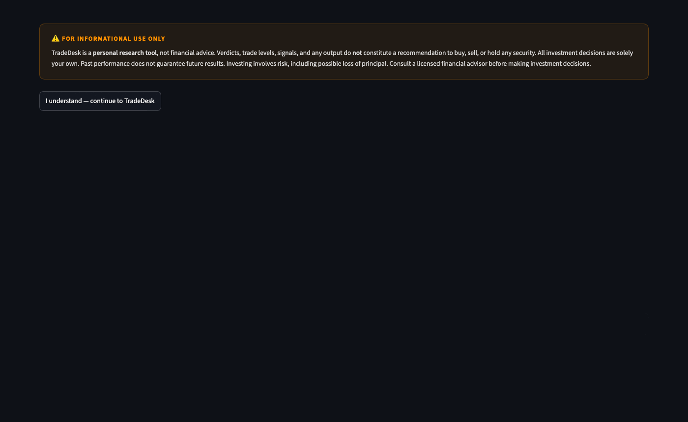

# TradeDesk

> A local-first stock analysis terminal. Pulls real-time data via yfinance, synthesizes 20+ technical, fundamental, and sentiment signals into a plain-English verdict with confidence score, AI-generated investment thesis, smart trade levels, portfolio tracking, and price alerts. No subscriptions. No data leaves your machine.

  



---

## Features

| Area | What it does |
|---|---|
| **Verdict** | BUY / HOLD / SELL with confidence score, weighted across technical (40%), fundamental (35%), sentiment (25%) |
| **Smart Trade Strategy** | Limit entry, stop loss, TP1/TP2 — snapped to support/resistance, scaled by conviction and risk factors |
| **AI Thesis** | Plain-English bull/bear case, key catalyst, key risk — synthesized from all 20+ signals |
| **Technical** | SMA 20/50 crossover, MACD, RSI, Bollinger Bands, volume analysis, candlestick patterns |
| **Fundamental** | P/E, EPS, FCF yield, EV/EBITDA, revenue growth, Piotroski F-Score (0-9), Altman Z-Score |
| **Market Context** | VIX regime, 52-week rank, sector ETF momentum, relative performance vs S&P 500 |
| **Momentum** | Price returns across 1mo / 3mo / 6mo / 1yr with trend classification |
| **Sentiment** | News headlines scored with FinBERT (runs locally, offline after first download) |
| **Analyst Data** | Consensus rating, price target, upside %, number of analysts |
| **Insider Activity** | Recent buy/sell transactions with position info |
| **Institutional Ownership** | % held by institutions and insiders |
| **Short Interest** | Short % of float, days to cover, squeeze potential |
| **Balance Sheet** | Debt, cash, net debt, revenue trends YoY |
| **Earnings** | Surprise history, next earnings date, proximity warning |
| **Options Sentiment** | Put/Call ratio with market interpretation |
| **Portfolio** | P&L tracking, daily change, allocation pie chart, holdings correlation matrix |
| **Watchlist** | Auto-refresh (1/5/15 min), quick verdict per ticker |
| **Alerts** | Price alerts with Mac desktop push notifications (runs in background) |
| **Backtest** | SMA crossover strategy backtest with win rate and Sharpe ratio |
| **ELI5** | Plain-English glossary for every term and chart in the app |
| **Caching** | SQLite-backed cache with per-data-type TTLs — fast repeat loads |

---

## Stack

- **UI** — [Streamlit](https://streamlit.io)
- **Data** — [yfinance](https://github.com/ranaroussi/yfinance) (free, no API key)
- **Charts** — [Plotly](https://plotly.com)
- **Sentiment** — [FinBERT](https://huggingface.co/ProsusAI/finbert) (local, CPU)
- **Technical indicators** — [FinTA](https://github.com/peerchemist/finta)
- **Backtesting** — [vectorbt](https://vectorbt.dev)
- **Storage** — SQLite (stdlib)
- **Notifications** — `osascript` (macOS only)

---

## Quick Start

```bash
git clone https://github.com/akhilsinghcodes/trade_desk.git
cd trade_desk

python -m venv .venv
source .venv/bin/activate

pip install -r requirements.txt

streamlit run app/main.py
```

Open [http://localhost:8501](http://localhost:8501).

> **FinBERT** (~500MB) downloads on first sentiment analysis. Subsequent runs use local cache.

---

## Project Structure

```
trade_desk/
├── app/
│   └── main.py              # Streamlit app entry point
├── modules/
│   ├── cached_fetch.py      # SQLite-cached API wrappers
│   ├── db.py                # SQLite layer (watchlist, portfolio, alerts, cache)
│   ├── score.py             # Combined signal scoring
│   ├── trade_strategy.py    # Smart trade levels (entry, SL, TP, exit conditions)
│   ├── thesis.py            # AI investment thesis generator
│   ├── piotroski.py         # Piotroski F-Score
│   ├── altman_z.py          # Altman Z-Score (bankruptcy risk)
│   ├── momentum.py          # Multi-timeframe price momentum
│   ├── market_context.py    # VIX + 52-week rank
│   ├── sector_momentum.py   # Sector ETF trend
│   ├── eli5.py              # Plain-English glossary (60+ terms)
│   └── ...                  # 25+ other signal modules
├── data/                    # Local SQLite DB + JSON (gitignored)
├── requirements.txt
└── README.md
```

---

## Data & Privacy

- All data fetched from **Yahoo Finance** via yfinance — no account or API key required
- FinBERT sentiment model runs **entirely on your machine** — no text is sent externally
- Portfolio, watchlist, and alerts stored in **local SQLite** — nothing leaves your laptop
- No telemetry, no tracking, no third-party services

---

## Signals Used in Scoring

**Technical (40%)**
SMA crossover · MACD · RSI · Bollinger Bands · Volume · Candlestick patterns · VIX regime · 52W rank · Sector momentum · Price momentum

**Fundamental (35%)**
P/E ratio · Revenue growth · Profit margin · FCF yield · EV/EBITDA · Piotroski F-Score · Altman Z-Score · Balance sheet trends · Short interest · Earnings proximity · Share dilution

**Sentiment (25%)**
FinBERT news sentiment · Analyst consensus · Insider transactions · Institutional ownership · Options put/call ratio · Relative performance vs S&P 500

---

## Platform Notes

- **macOS** — full support including desktop push notifications
- **Linux/Windows** — all features except `osascript` notifications (alerts still visible in-app)
- Python **3.11+** required

---

## Disclaimer

TradeDesk is for **informational and educational purposes only**. Nothing in this app constitutes financial advice. Always do your own research before making investment decisions.

See [DISCLAIMER.md](DISCLAIMER.md) for the full legal notice.

---

## License

MIT — see [LICENSE](LICENSE)
