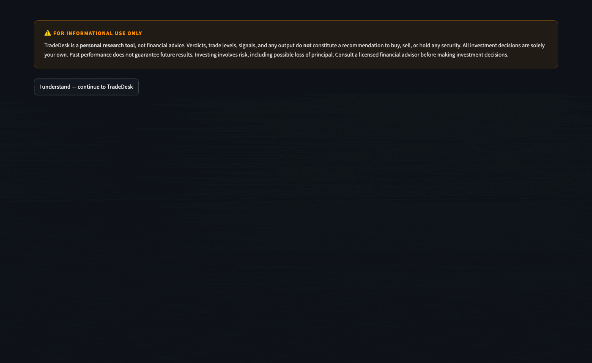

# TradeDesk

> A local-first stock analysis terminal. Pulls real-time data via yfinance, synthesizes 20+ technical, fundamental, and sentiment signals into a plain-English verdict with confidence score, AI-generated investment thesis, smart trade levels, portfolio tracking, and price alerts. No subscriptions. No data leaves your machine.

  
[](https://github.com/akhilsinghcodes/trade_desk/actions/workflows/ci.yml)



---

## Features

| Area | What it does |
|---|---|
| **Verdict** | BUY / HOLD / SELL built ONLY from the price signals with real measured predictive power (IC), weighted by that measured power — backtested with a split-half stability gate, not a hand-picked weighting |
| **ML Model Prediction** | XGBoost regressor (trained in [trade_ml](../trade_ml), published here, runs in-process) predicting 5-day forward return, shown with this specific ticker's own walk-forward validated track record — or the model's honest aggregate stats for tickers outside the backtested universe. Flagged when it agrees/disagrees with the composite verdict (agreement is itself a validated confidence signal — see [ARCHITECTURE.md](../ARCHITECTURE.md)) |
| **ATR Trade Levels** | Entry/stop/target sized off a validated 1.0×/3.0× ATR barrier scheme — grid-searched and backtested (442k trades, 149 tickers, 2011–2026), not the old untested guess |
| **Smart Trade Strategy** | Limit entry, stop loss, TP1/TP2 — snapped to support/resistance, scaled by conviction and risk factors (unvalidated, algo-generated — labeled as such in-app) |
| **AI Thesis** | Plain-English bull/bear case, key catalyst, key risk — synthesized from all 20+ signals |
| **Technical** | SMA 20/50 crossover, MACD, RSI, Bollinger Bands, volume analysis, candlestick patterns |
| **Fundamental** | P/E, EPS, FCF yield, EV/EBITDA, revenue growth, Piotroski F-Score (0-9), Altman Z-Score |
| **Market Context** | VIX regime, 52-week rank, sector ETF momentum, relative performance vs S&P 500 |
| **Momentum** | Price returns across 1mo / 3mo / 6mo / 1yr with trend classification |
| **Sentiment** | News headlines scored with FinBERT (runs locally, offline after first download) |
| **Analyst Data** | Consensus rating, price target, upside %, number of analysts |
| **Insider Activity** | Recent buy/sell transactions with position info |
| **Institutional Ownership** | % held by institutions and insiders |
| **Short Interest** | Short % of float, days to cover, squeeze potential |
| **Balance Sheet** | Debt, cash, net debt, revenue trends YoY |
| **Earnings** | Surprise history, next earnings date, proximity warning |
| **Options Sentiment** | Put/Call ratio with market interpretation |
| **Portfolio** | P&L tracking, daily change, allocation pie chart, holdings correlation matrix |
| **Watchlist** | Auto-refresh (1/5/15 min), quick verdict per ticker |
| **Alerts** | Price alerts with Mac desktop push notifications (runs in background) |
| **Screener** | Scan up to 20 tickers in parallel — ranked by composite score, sortable, CSV export, click-through to Analyze |
| **Backtest** | SMA crossover walk-forward backtest — win rate, Sharpe ratio, benchmark vs SPY, transaction cost simulation |
| **Model Ledger** | Logged history of the ML model's live predictions vs actual outcomes — running accuracy check, not a one-time backtest claim |
| **ELI5** | Plain-English glossary for every term and chart in the app |
| **Caching** | SQLite-backed cache with per-data-type TTLs (config/settings.yaml) — fast repeat loads, stale-on-error fallback |
| **Config** | Weights, thresholds, and TTLs tunable via `config/settings.yaml` — no code changes required |

---

## Stack

- **UI** — [Streamlit](https://streamlit.io)
- **Data** — [yfinance](https://github.com/ranaroussi/yfinance) (free, no API key)
- **Charts** — [Plotly](https://plotly.com)
- **Sentiment** — [FinBERT](https://huggingface.co/ProsusAI/finbert) (local, CPU)
- **Technical indicators** — [FinTA](https://github.com/peerchemist/finta)
- **ML model** — [XGBoost](https://xgboost.readthedocs.io) (trained in [trade_ml](../trade_ml), served here in-process)
- **Backtesting** — [vectorbt](https://vectorbt.dev)
- **Storage** — SQLite (stdlib)
- **Notifications** — `osascript` (macOS only)

---

## Quick Start

TradeDesk lives inside the [trade_lab monorepo](../README.md) as its own independent sub-project:

```bash
git clone <this-repo-url> trade_lab
cd trade_lab/trade_desk

python3 -m venv .venv
source .venv/bin/activate

pip install -r requirements.txt

streamlit run app/main.py
```

Open [http://localhost:8501](http://localhost:8501).

> **FinBERT** (~500MB) downloads on first sentiment analysis. Subsequent runs use local cache.

---

## Project Structure

```
trade_desk/                  # this sub-project — see ../ARCHITECTURE.md for the
│                             # monorepo-level picture (trade_ml hand-off, etc.)
├── app/
│   ├── main.py              # Entry point — page config, sidebar, routing
│   ├── views/                # One file per page
│   │   ├── analyze.py        # Main analysis page (verdict, ML panel, tabs)
│   │   ├── screener.py       # Multi-ticker screener
│   │   ├── watchlist.py      # Watchlist with auto-refresh
│   │   ├── portfolio.py      # P&L tracking + correlation matrix
│   │   ├── alerts.py         # Price alerts
│   │   ├── model_ledger.py   # Logged ML prediction history vs outcomes
│   │   └── eli5.py           # Glossary
│   └── services/
│       └── analysis.py      # Orchestrates all signal modules → analysis dict
├── modules/
│   ├── cached_fetch.py      # SQLite-cached API wrappers with stale-on-error
│   ├── db.py                # SQLite layer (watchlist, portfolio, alerts, cache)
│   ├── score.py             # Legacy hand-weighted score (superseded by
│   │                         # factor_analysis.py for the displayed verdict)
│   ├── factor_analysis.py   # Validated composite verdict (IC-weighted, backtested)
│   ├── ml_features.py       # ML model's feature computation — ported from
│   │                         # trade_ml (see ARCHITECTURE.md for why it's a
│   │                         # copy, not a cross-repo import)
│   ├── ml_verdict.py        # Loads models/return_model.pkl, runs it live
│   │                         # in-process for any ticker
│   ├── support_resistance.py # ATR trade levels (validated 1.0x/3.0x scheme)
│   ├── config.py            # YAML config loader (weights, thresholds, TTLs)
│   ├── backtest.py          # Walk-forward SMA backtest + SPY benchmark
│   ├── trade_strategy.py    # Smart trade levels (entry, SL, TP) — unvalidated
│   ├── thesis.py            # AI investment thesis generator
│   ├── piotroski.py         # Piotroski F-Score
│   ├── altman_z.py          # Altman Z-Score (bankruptcy risk)
│   ├── momentum.py          # Multi-timeframe price momentum
│   ├── market_context.py    # VIX + 52-week rank
│   ├── sector_momentum.py   # Sector ETF trend
│   └── ...                  # 20+ other signal modules
├── models/                   # Published ML artifacts (from trade_ml) —
│   │                         # return_model.pkl, ticker_track_record.json,
│   │                         # aggregate_stats.json. See ARCHITECTURE.md.
├── config/
│   └── settings.yaml        # Weights, thresholds, cache TTLs
├── data/                    # Local SQLite DB (gitignored)
├── requirements.txt
└── README.md
```

---

## Data & Privacy

- All data fetched from **Yahoo Finance** via yfinance — no account or API key required
- FinBERT sentiment model runs **entirely on your machine** — no text is sent externally
- Portfolio, watchlist, and alerts stored in **local SQLite** — nothing leaves your laptop
- No telemetry, no tracking, no third-party services

---

## Signals Used in Scoring

**Technical (40%)**
SMA crossover · MACD · RSI · Bollinger Bands · Volume · Candlestick patterns · VIX regime · 52W rank · Sector momentum · Price momentum

**Fundamental (35%)**
P/E ratio · Revenue growth · Profit margin · FCF yield · EV/EBITDA · Piotroski F-Score · Altman Z-Score · Balance sheet trends · Short interest · Earnings proximity · Share dilution

**Sentiment (25%)**
FinBERT news sentiment · Analyst consensus · Insider transactions · Institutional ownership · Options put/call ratio · Relative performance vs S&P 500

---

## Platform Notes

- **macOS** — full support including desktop push notifications
- **Linux/Windows** — all features except `osascript` notifications (alerts still visible in-app)
- Python **3.11+** required

---

## Disclaimer

TradeDesk is for **informational and educational purposes only**. Nothing in this app constitutes financial advice. Always do your own research before making investment decisions.

See [DISCLAIMER.md](DISCLAIMER.md) for the full legal notice.

---

## License

MIT — see [LICENSE](LICENSE)
